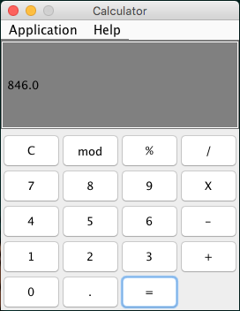

# Calculator

A calculator GUI app which provides the typical functionalities in addition to the mod operation. Implemented Java OOP design and allowed the ability to interact with the application via key presses or button clicks. This is an open source project, so please feel free to clone the repo and run the application locally. 

# Technologies Used:
* Java
* Java Swing Library
